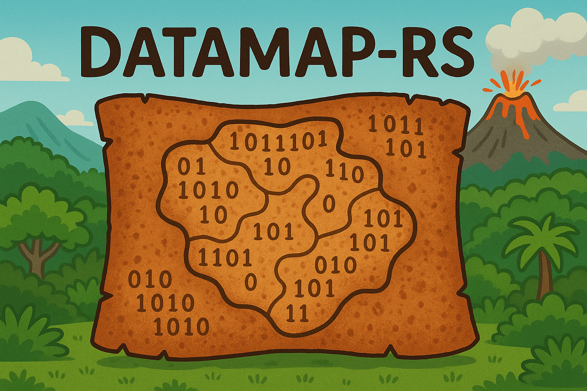

# DataMap

A high-performance data processing pipeline for large-scale datasets built in Rust.

<div align="center">
    
</div>

## Overview

DataMap is a Rust-based toolkit designed for efficient processing, filtering, and transformation of large text datasets, primarily in JSONL format. It provides a flexible, distributed architecture for data operations with high-performance parallel processing.

**Key features:**
- Multi-threaded processing with Rayon
- Configurable processing pipeline via JSON/YAML configuration
- Comprehensive set of data transformation operations
- High-performance parallel file processing
- Memory-efficient streaming operations

**Important:** This tool is designed for local file processing. We strongly recommend using [i4i/i7i EC2 instances](https://aws.amazon.com/ec2/instance-types/i4i/) with large AWS Nitro Drives for optimal performance. We have found that streaming of remote data sources (e.g. S3) is finnicky and unreliable, so a local-only solution is reliable and efficient, particularly with fast AWS S3 wrappers like [s5cmd](https://github.com/peak/s5cmd)

## Commands

DataMap provides the following operations:

### Map
Passes data through a highly customizable data processing pipeline that includes filtering and annotating data. Every processor/filter/annotator operates on each document independently, allowing for embarrassingly parallel processing.

[📖 Detailed documentation](docs/map.md)

### Reshard
Takes a data pool with data files of uneven size and reorganizes them into files of a maximum target size (typically ~256MB before compression, the "sweet spot" for many applications). Can be configured to respect subdirectory structure.

[📖 Detailed documentation](docs/reshard.md)

### Reservoir Sample
Gathers statistics about data through distributed reservoir sampling. Useful for understanding data distributions before partitioning or for quality analysis.

[📖 Detailed documentation](docs/reservoir_sample.md)

### Discrete Partition
Partitions data into subdirectories based on a key with discrete support (i.e., a small number of categories like language, domain, or classification labels).

[📖 Detailed documentation](docs/partition.md)

### Range Partition
Partitions data into subdirectories based on a key with continuous support. Requires either a reservoir sample or predefined range groups to effectively partition the data on a continuous signal.

[📖 Detailed documentation](docs/partition.md)

### Group
A highly distributed grouping operation that ensures all documents with the same "group ID" live in the same JSONL file (or collection of JSONL files with easily identifiable names). Essential for deduplication workflows.

[📖 Detailed documentation](docs/group.md)

### GroupFilter
After data has been grouped, keeps just one document from each group. Can apply logic to select which document to keep (e.g., first or last according to a sort key).

[📖 Detailed documentation](docs/group.md)

### Shuffle
Coarsely shuffles data into a large collection of new files. Redistributes data across files but doesn't shuffle data within each individual file.

[📖 Detailed documentation](docs/shuffle.md)

### Count
Counts the number of documents, file sizes, and optionally the total size of a specified text field across a dataset. Useful for dataset statistics and validation.

[📖 Detailed documentation](docs/count.md)

## Installation

1. **Install Rust** (if not already installed):
```bash
   curl --proto '=https' --tlsv1.2 -sSf https://sh.rustup.rs | sh
```
   Visit https://www.rust-lang.org/tools/install for more options.

2. **Clone the repository**:
```bash
   git clone
   cd datamap
```

3. **Build the project**:
```bash
   cargo build --release
```
   The binary will be available at `target/release/datamap`

4. **(Optional) Install Python dependencies for cloud utilities**:
```bash
   pip install boto3 click tqdm
```

5. **(Optional) Install s5cmd for cloud storage**:
```bash
   # For Linux systems
   wget https://github.com/peak/s5cmd/releases/download/v2.2.2/s5cmd_2.2.2_Linux-64bit.tar.gz
   tar -xvzf s5cmd_2.2.2_Linux-64bit.tar.gz
   sudo mv s5cmd /usr/local/bin
```

6. **(Optional) Run tests**
```bash
   mkdir -p ft_classifiers
   wget https://dl.fbaipublicfiles.com/fasttext/supervised-models/lid.176.bin -O ft_classifiers/lid176.bin
   cargo test
```

## Performance Notes

- **Parallelism**: DataMap processes files in parallel using all available CPU cores by default
- **Thread Control**: Use `--threads N` to limit parallelism (useful for memory-constrained environments)
- **Memory Usage**: Scales with the number of parallel files being processed. Large documents may require additional memory
- **Sequential Processing**: Documents are processed sequentially through pipeline stages to maintain consistency
- **File Size**: The 256MB "sweet spot" for file sizes balances parallel processing efficiency with memory usage
- **Storage**: Local NVMe storage (like AWS Nitro) dramatically outperforms network-attached storage

## Cloud Storage Integration

We strongly recommend using [s5cmd](https://github.com/peak/s5cmd) for efficient S3 interaction. The workflow of downloading to local storage, processing, and re-uploading is more efficient and stable than direct S3 interaction.

**Using s5cmd CLI directly:**
```bash
s5cmd sync s3://bucket/path ./local/path
# ... process with datamap ...
s5cmd sync ./local/path s3://bucket/output
```

**Using Python wrappers:**
```bash
python utils/s5cmd_wrapper.py download --src s3://bucket/path --dst ./local/path [--part 0 --num-parts 4]
python utils/s5cmd_wrapper.py upload --src ./local/path --dst s3://bucket/path
```

## Examples

We provide example configuration files for common data processing workflows:

- **DCLM Pipeline**: Configurations for the DCLM data processing flow
- **All-Dressed™ Mixture**: Our complete data mixture pipeline

These examples are in the `configs/` directory and are nearly plug-and-play. Note: Some configurations require downloading the `lid176.bin` FastText language classification model. Run `/configs/all_dressed/download_lid.sh` to download it.

## Documentation

Detailed documentation for each command is available in the `docs/` directory:

- [Map Command](docs/map.md) - Filtering and transformation pipelines
- [Reshard Command](docs/reshard.md) - File size normalization
- [Reservoir Sample Command](docs/reservoir_sample.md) - Statistical sampling
- [Discrete Partition Command](docs/discrete_partition.md) - Categorical partitioning
- [Range Partition Command](docs/range_partition.md) - Continuous value partitioning
- [Group Command](docs/group.md) - Document grouping
- [GroupFilter Command](docs/group_filter.md) - Group-based deduplication
- [Shuffle Command](docs/shuffle.md) - Data shuffling
- [Count Command](docs/count.md) - Dataset statistics
